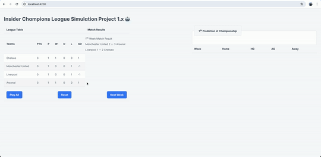

# Insider Champions League Simulation Project 1.x 🤖⚽

A test task that emulates the Champions League.
Tech stack:

- 🐘 PHP, Laravel, MySQL
- 🐳 Docker, Docker Compose, Laravel Sail
- ⚛️ Angular, TypeScript, SCSS

## Installation 🚀

1. Clone the repository.
2. Run `composer install` in the root directory.
3. Run `./vendor/bin/sail up` in the root directory.
4. Run `./vendor/bin/sail artisan migrate --seed` for database migration and seeding.
5. Go to `http://localhost:4200/` in your browser.

## Usage ⚽

- By default, there are 4 teams in the Champions League.
- On your first visit, the first round will be generated.
- Simulate the next round by clicking the "Next week" button.
- Simulate the entire season by clicking the "Play All" button.
- Reset the season by clicking the "Reset" button.
- A grid with the results will be displayed only in season mode.
- Predictions are generated only after the 4th week.

## File Structure 📁
- Custom PHP classes are located in the `app/` directory.
- Angular components are located in the `league-front/src/app/` directory.

## Testing 🧪

- Run `./vendor/bin/sail artisan test` in the root directory. The tests include integration tests for the API and unit tests for the services.
- Postman collection is available in the `static/Football.postman_collection.json` file.